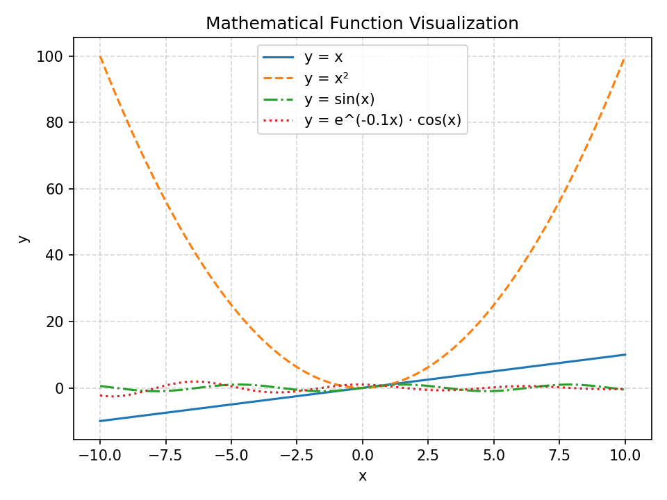
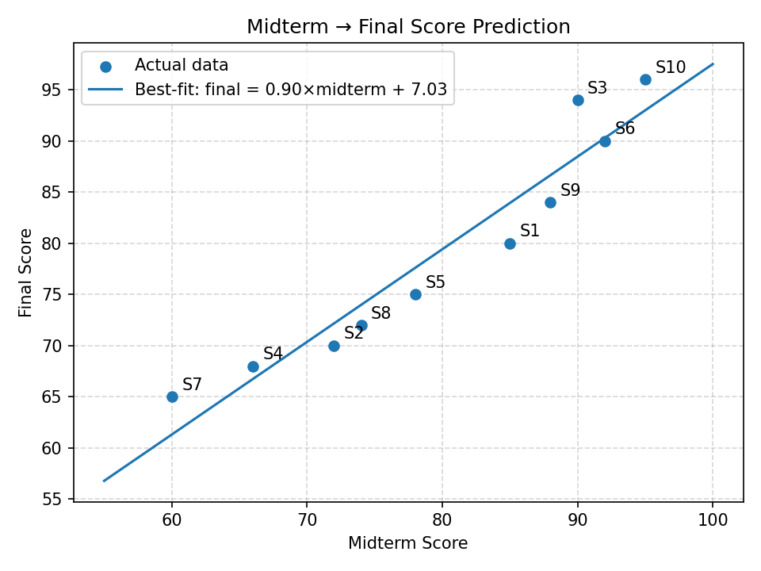

# Math Visualization Assignment

A Python project that visualizes mathematical functions and student score data using NumPy and Matplotlib.

## Libraries Used

- `numpy` — numerical computation and array operations
- `matplotlib` — plotting and visualization

## How to Run

```bash
pip install numpy matplotlib
python3 math_visualization.py
```

All output images will be saved in the same directory.

## Generated Graphs

### Mathematical Function Visualization


### Midterm → Final Score Prediction


## Reflection

**How does visualization help us understand mathematical functions and data?**
Visualization helps us understand relationships and patterns harvestable from data, but hard to detect in raw numbers. It also eases comparing multiple functions since the results are shown together in a single graph.

**Which plot was most useful in this assignment and why?**
The best-fit line scatter plot (Task 4) was the most useful. It actually does something with the data instead of just showing it to the viewer.

**What is the role of NumPy and Matplotlib in your project?**
NumPy handles all the math — generating evenly spaced x values with `linspace`, computing array operations, and fitting the regression line with `polyfit`. Matplotlib takes those arrays and turns them into clean, labeled plots that can be saved as image files.
